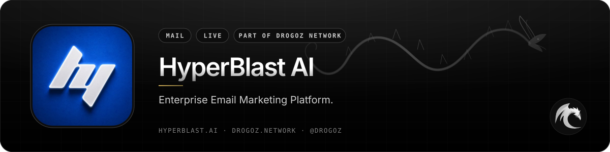
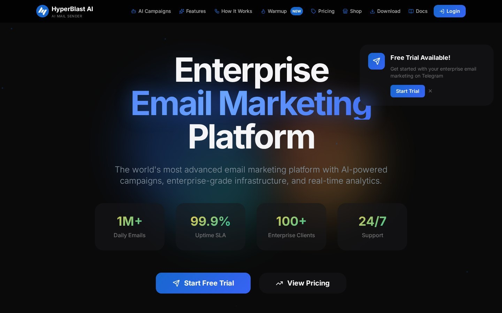
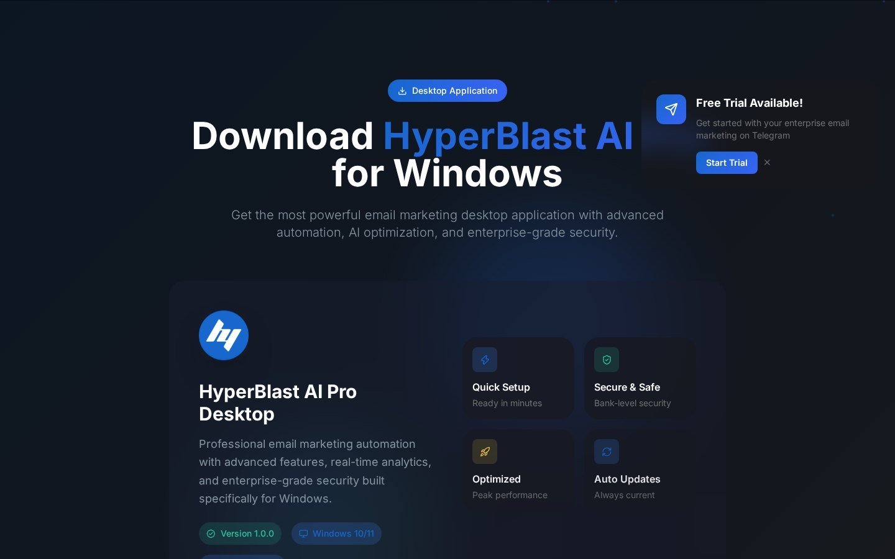
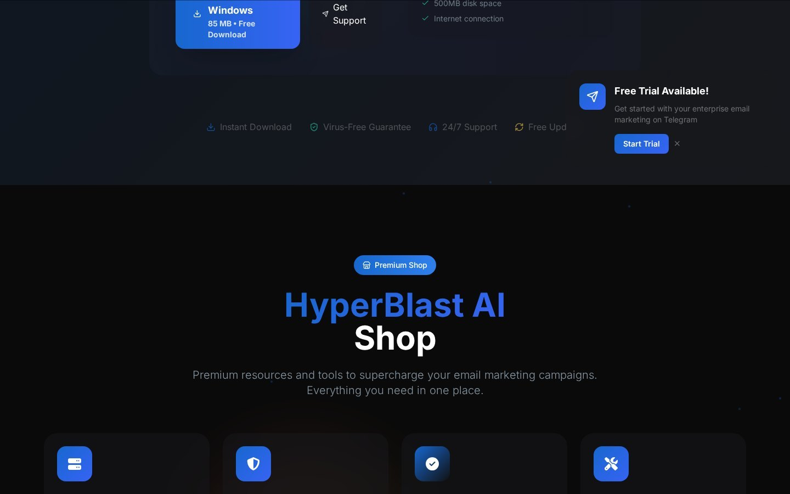
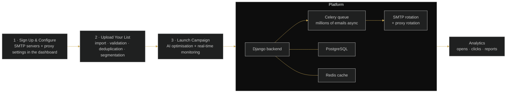

 

# HyperBlast AI

### Enterprise Email Marketing Platform.

 

  

 

## 📋 Table of contents

- [Overview](#-overview)
- [Key features](#-key-features)
- [Screenshots](#-screenshots)
- [How it works](#%EF%B8%8F-how-it-works)
- [Use cases](#-use-cases)
- [Pricing](#-pricing)
- [Free live demonstration](#-free-live-demonstration)
- [Links](#-links)

## 🧭 Overview

HyperBlast AI is a professional bulk email marketing system with AI-powered campaigns, enterprise-grade infrastructure and real-time analytics. It combines campaign creation and scheduling, multi-SMTP support with rotation and testing, HTTP/HTTPS/SOCKS proxy support, list import with deduplication and high-deliverability optimization in one platform.

The AI layer transforms every campaign: Smart Content Generation analyses your industry, audience and objectives to produce subject lines, personalised copy and calls-to-action, while Send Time Intelligence learns recipient behaviour, engagement history and time zones to deliver every email at the optimal moment for each subscriber.

HyperBlast AI also offers a professional Email Warm-up service (gradual volume increase, engagement simulation, reputation monitoring and automated optimisation across Gmail, Outlook, Yahoo, Apple Mail and AOL), a Premium Shop with SMTP servers, proxies, verification and tools, and **HyperBlast AI Pro Desktop** for Windows 10/11. The platform is built on Django, PostgreSQL, Redis and Celery.

<table>
<tr>
<td align="center" width="25%"><b>Category</b> Mail</td>
<td align="center" width="25%"><b>Status</b> Live</td>
<td align="center" width="25%"><b>Bundle</b> Traffic (−5%)</td>
<td align="center" width="25%"><b>Pricing</b> Sign in to see pricing</td>
</tr>
</table>

## ✨ Key features

### 📬 Campaigns & delivery

- **Campaign Creation & Scheduling** with **Real-Time Campaign Monitoring**.
- **Multi-SMTP Support**, **SMTP Rotation & Testing** — intelligent routing and automatic failover.
- **HTTP/HTTPS/SOCKS Proxy Support** and **Proxy Rotation Tools**.
- **HTML Email Templates** with **Automatic Plain Text Conversion**.
- **High Deliverability Optimization** and **Spam Check Services**.

### 🤖 AI-powered campaigns

- **Smart Content Generation** — AI-generated high-converting subject lines, personalised email content, intelligent CTA optimisation, automated A/B testing, industry-specific templates, brand-aware writing style.
- **Send Time Intelligence** — individual send-time optimisation, smart time-zone detection, behavioural engagement analysis, AI-powered open-rate prediction, continuous learning.

### 📋 Lists & data

- **Email List Import & Deduplication** with advanced validation and segmentation.
- **Email Verification Tools** — clean your lists before you send.
- **Real-time analytics** — open rates, click-through rates and detailed reporting dashboards.

### 🔥 Warm-up service

- **Gradual Volume Increase** over 2–4 weeks to build sender reputation naturally.
- **Engagement Simulation** — a network of real accounts opens, clicks and replies to warm-up emails.
- **Reputation Monitoring** across all major ISPs and **Automated Optimization** by AI.

### 🏢 Platform & business

- **User Management & Subscription Plans**, **Credit & Balance Management**, **Transaction Tracking**.
- **Marketplace Integration** — Premium Shop with SMTP servers, residential & datacenter proxies, verification and advanced tools.
- **HyperBlast AI Pro Desktop** — Windows 10/11 application (v1.0.0 · 85 MB) with auto updates.
- **Technology stack** — Django backend, PostgreSQL, Redis cache, Celery distributed task queue.

## 🖼️ Screenshots

> Product images from [hyperblast.ai](https://hyperblast.ai/) and the [service page](https://drogoz.network/services/HyperBlast/) on drogoz.network.

<table>
<tr>
<td width="50%" align="center"> HyperBlast AI — Enterprise Email Marketing Platform</td>
<td width="50%" align="center"> HyperBlast AI Pro Desktop for Windows</td>
</tr>
<tr>
<td colspan="2" align="center"> HyperBlast AI — Premium Shop</td>
</tr>
</table>

## ⚙️ How it works

**Getting started is simple**

## 🎯 Use cases

<table>
<tr>
<td width="50%" valign="top"><b>📈 Enterprise email marketing</b> High-volume campaigns with multi-SMTP rotation, proxies and deliverability optimisation.</td>
<td width="50%" valign="top"><b>🧠 AI-optimised outreach</b> Subject lines, content and send times tuned per recipient by machine learning.</td>
</tr>
<tr>
<td width="50%" valign="top"><b>🌡️ New domain warm-up</b> Build sender reputation gradually with engagement simulation and ISP monitoring.</td>
<td width="50%" valign="top"><b>🖥️ Desktop operators</b> HyperBlast AI Pro Desktop for Windows with automation and real-time analytics.</td>
</tr>
</table>

## 💳 Pricing

> **Sign in at [drogoz.network](https://drogoz.network/accounts/login/) to see pricing.** Your exact monthly cost, in seconds — no quotes, nothing hidden.

HyperBlast AI is part of the **Traffic** bundle (−5%) — *Everything for traffic ops* — and of **All In One** (−10%) — *Every product, best price*. Take several products together and save more: [Packages & bundles](https://drogoz.network/#packages) · [Pricing & calculator](https://drogoz.network/pricing/).

| Bundle | Discount | Included |
|---|---|---|
| **Traffic** | −5% | Lidaro AI, HyperBlast AI, VerifHub AI |
| **All In One** | −10% | Drog AI, MyMask AI, Replika, Lidaro AI, IMPERATORI, ZOI Talks, RiderSwap, HyperBlast AI, VerifHub AI, Vadira, Skriper |

## 🎥 Free live demonstration

**A live demonstration is 100% free on every product.** 
See HyperBlast AI in action before you pay — our agent gets in touch and walks you through a live demonstration.

Registration is handled by our team — get in touch and receive personal access.

## 🔗 Links

| Channel | Link |
|---|---|
| 🌐 **Website** | [hyperblast.ai](https://hyperblast.ai/) |
| 📄 **Details page** | [drogoz.network/services/HyperBlast/](https://drogoz.network/services/HyperBlast/) |
| ✈️ **Telegram group** | [@hyperblast](https://t.me/hyperblast) |
| 🏛️ **Drogoz Network** | [drogoz.network](https://drogoz.network) · [Services](https://drogoz.network/#services) · [Packages](https://drogoz.network/#packages) · [Pricing](https://drogoz.network/pricing/) · [Presentation](https://drogoz.network/presentation/) |
| ⚖️ **Legal** | [Terms of Service](https://drogoz.network/legal/terms-of-service/) · [Acceptable Use](https://drogoz.network/legal/acceptable-use-policy/) · [Privacy](https://drogoz.network/legal/privacy-policy/) · [Refunds](https://drogoz.network/legal/refund-policy/) · [Disclaimer](https://drogoz.network/legal/disclaimer/) · [Compliance](https://drogoz.network/legal/compliance-policy/) |
| 🐙 **GitHub** | [deepdrogo](https://github.com/deepdrogo/deepdrogo) |

 

   
  
    
  <b>Made by <a href="https://drogoz.network">Drogoz Network</a></b> 
  One network — all your services · Premium SaaS Network
    
  
  
  
  
    
  <b>More from the network:</b> <a href="https://github.com/deepdrogo/drog-ai">Drog AI</a> · <a href="https://github.com/deepdrogo/mymask-ai">MyMask AI</a> · <a href="https://github.com/deepdrogo/replika">Replika</a> · <a href="https://github.com/deepdrogo/lidaro-ai">Lidaro AI</a> · <a href="https://github.com/deepdrogo/imperatori">IMPERATORI</a> · <a href="https://github.com/deepdrogo/zoi-talks">ZOI Talks</a> · <a href="https://github.com/deepdrogo/riderswap-io">RiderSwap</a> · <a href="https://github.com/deepdrogo/verifhub-ai">VerifHub AI</a> · <a href="https://github.com/deepdrogo/vadira-net">Vadira</a> · <a href="https://github.com/deepdrogo/skriper-io">Skriper</a> · <a href="https://github.com/deepdrogo/mytasker">MyTasker</a> · <a href="https://github.com/deepdrogo/mamont-tech">Mamont</a>
    
  © 2026 Drogoz Network. All rights reserved. Provided strictly for lawful use — see the <a href="https://drogoz.network/legal/">Legal Center</a>. Each user is solely responsible for how they use the software.

